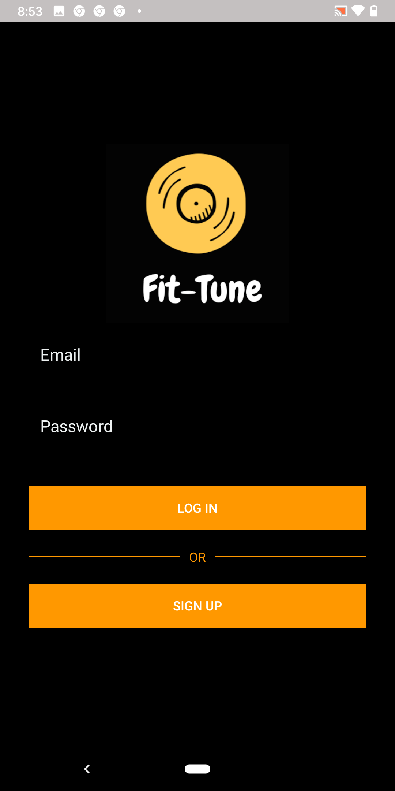
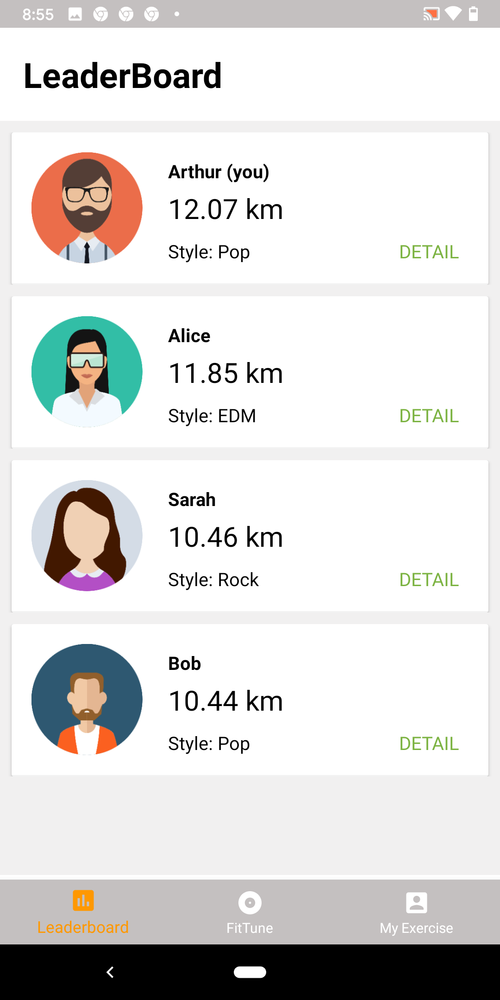
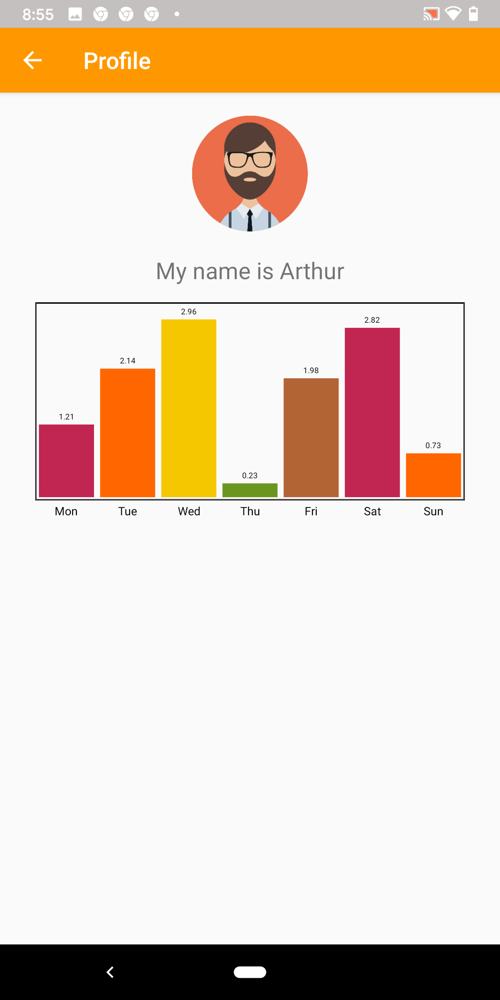
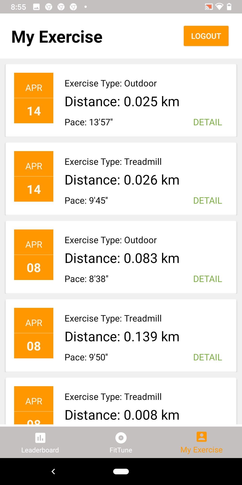
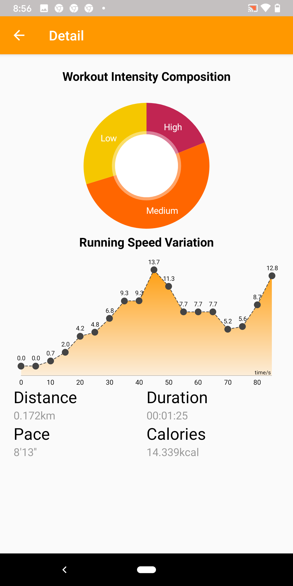

# Fit-Tune 

Group project from course "Creative Mobile Applications". The goal of Fit-Tune is to improve user workout experience by providing real time smart music tempo and style adjustment based on sensor readings from your smart phone. Demo video can be found on the course website.
http://www.eecg.utoronto.ca/~jayar/ece1778/projects-videos-reports.html

<table>
 <tr>
   <td></td>
 </tr>
 <tr>
   <td></td>
   <td></td>
 </tr>
 <tr>
   <td></td>
   <td></td>
 </tr>
</table>

